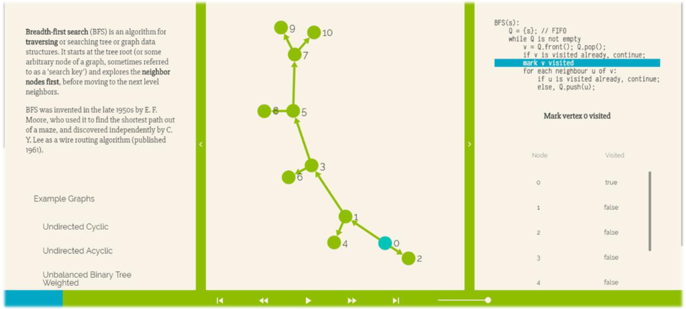

# AlgoriVA

A modular algorithm visualization software.

Try the web app [here](https://omeryagmurlu.gitlab.io/algoriv)!



I developed this project during my second year in high school as part of the Technology Student Association Conference, Software Development Competition in 2016, where it ranked 8th place. You can find the accompanying report [here](https://github.com/omeryagmurlu/algoriv/blob/portfolio/Software-Development.pdf).

## Installation

* [Linux](https://gitlab.com/omeryagmurlu/algoriv/builds/artifacts/master/browse/release?job=linux-binary)
* [Windows](https://gitlab.com/omeryagmurlu/algoriv/builds/artifacts/master/browse/release?job=win-binary)
* For OSx you must build the project

[Github Links](https://github.com/omeryagmurlu/algoriv/releases)

You can always use the web app [here](https://omeryagmurlu.gitlab.io/algoriv)

## Build

```bash
$ git clone git@gitlab.com:omeryagmurlu/TSA-Software.git algoriv
$ cd algoriv
$ yarn
$ yarn run watch:browser
```

## Packaging

```bash
$ yarn run package-linux
$ yarn run package-win
$ yarn run package-all
```

## Usage

See `docs/usage.md`

---

### File Structure and Grammar

```
- app
	- containers
	- features
	- views
	- components
	- styles
	- index.js
```

- Index refers to a container.
- Containers can **only** import **features**, **data**, another **containers** and **views**.
- Views can **only** import **components** and **styles**.
	- For routing, containers, or another views must supply the needed data.

#### `props.app` props, and `props.app.settings`

`app` is a common prop that every container and view has access to. It is used to trigger or retrive app specific actions. Components are prohibited to have access to it.

`app.settings` is the state saver. Only containers and views have access to it. Components may **only** have access to it's `visual-cache` subset for having persistent ui state.
